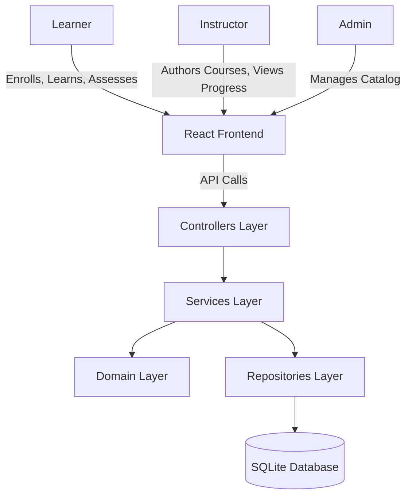

# System Architecture

LearnLab uses a clean, layered architectural pattern.

## Layered Structure
- **Controllers**: Entry points for the API. Handles HTTP requests and responses. Routes traffic to Services. (Auth boundaries are placed here).
- **Services**: Orchestrates business logic, retrieves data from Repositories, applies rules from Domain.
- **Repositories**: Handles data access and persistence to the SQLite database. Ensure append-only operations for tracking.
- **Domain**: Pure business rules and models. No external dependencies.

## Architecture Diagram (C4 Context)

